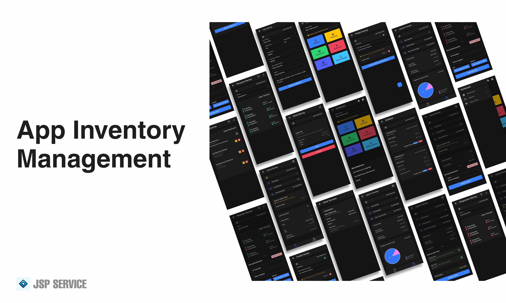

# Android Warehouse Inventory Management Template - Ionic 8 & Vue 3

This project provides a foundation for building a warehouse inventory management solution using Ionic v8 & Vue 3.

## Image Gallery

## Libraries Used

- [Ionic Framework](https://ionicframework.com/)
- [Vue.js](https://vuejs.org/)
- [Pinia](https://pinia.vuejs.org/)
- [Firebase](https://firebase.google.com/)
- [Capasitor](https://capacitorjs.com/)
- [Capasitor Firebase](https://github.com/capawesome-team/capacitor-firebase/)
- [Chartjs](https://www.chartjs.org/)
- ...

## Key Features:
  - Robust Tech Stack: Built with Ionic V8, Firebase Authentication, Firestore, Vue.js, and Pinia for state management.
  - Warehouse Management: Manage inventory, track sales, and generate reports for efficient warehouse operations.
  - Item Transfer: Easily transfer items between warehouse locations within the app.
  - Excel Reporting: Generate simple inventory reports in Excel format for efficient record-keeping.

## Donation-Based Access:

To access the full source code, we kindly ask for a donation. Your contributions help us maintain and improve this project continuously.

## How to Get Access:

- Make a donation through [#Donations](#Donations).
- Send us a message with your donation confirmation.
- You will be invited to the private repository containing the complete source code.

## Donations 

    > !!!! Please Include Your Github Username or Email, we will send you an invitation to our private repository. !!!!

- [Sociabuzz](https://sociabuzz.com/jspservice)
- [Saweria](https://saweria.co/JSPService)
- [Buy Me A Coffee](https://www.buymeacoffee.com/j3rr7)

## Contact Us

Mail us here : [cariuanggenz@gmail.com](mailto:cariuanggenz@gmail.com)
  

## Benefits of Donating:

    - Full Source Code: Get the complete codebase of this Android app template.
    - Updates & Improvements: Benefit from ongoing updates, bug fixes, and feature enhancements.
    - Feature Requests: Donate a fixed amount and get the opportunity to request specific features you'd like to see implemented.

## Future Development:

We are committed to continuously improving this template and have exciting plans for the future, including:
  - Adding more features and functionalities
  - Expanding the app's functionality to include more warehouse management capabilities
  - Integrating additional third-party APIs for more advanced warehouse management features
  - Enhancing the user interface and user experience
  - Providing more customization options for the app's design and layout
  - Offering additional support and resources for users
